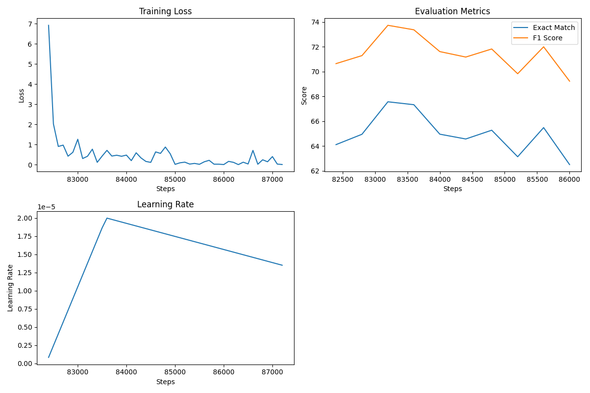
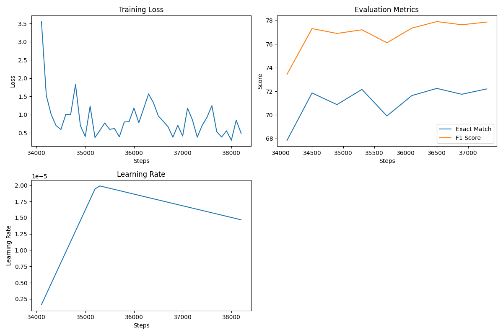
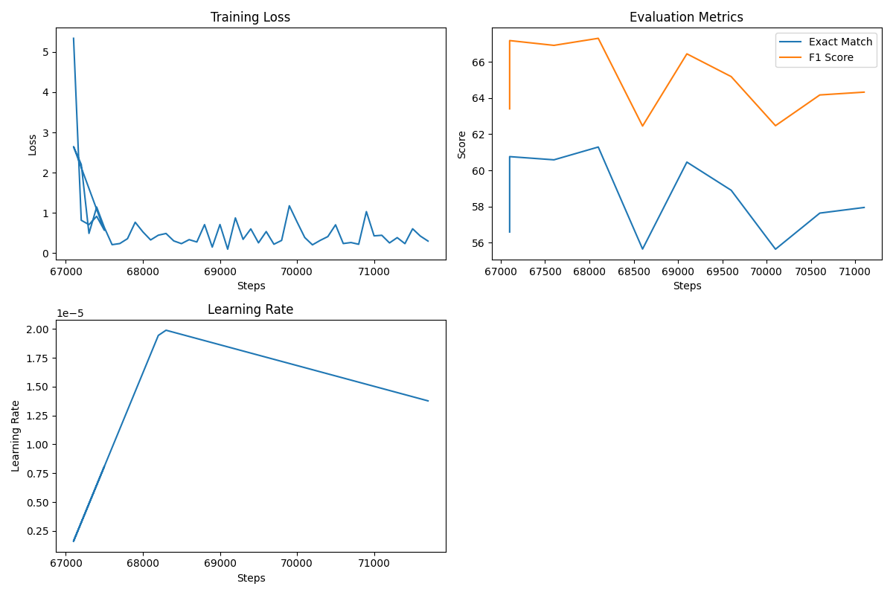

# Question Answering with Transformer Models

## Project Overview
This project explores the effectiveness of various transformer-based models for question answering on the SQuAD dataset. I fine-tuned multiple pre-trained models, evaluated their performance, and analyzed their behavior under standard and adversarial conditions.

## Goals
- Evaluate the performance of different transformer architectures on question answering tasks
- Compare model performance across both SQuAD 1.1 and SQuAD 2.0 datasets
- Assess model robustness against adversarial examples
- Identify optimal trade-offs between model size, computational requirements, and performance

## Methods
- Fine-tuned four transformer models (BERT, DistilBERT, ALBERT, and RoBERTa)
- Evaluated on standard benchmarks (SQuAD 1.1, SQuAD 2.0)
- Tested with adversarial attacks (AddSent and AddOneSent)
- Analyzed performance across different question types and answer contexts

## Models Explored
The project evaluated four different transformer architectures:

- **BERT**: Bidirectional Encoder Representations from Transformers, with 110M parameters (base version). BERT utilizes Next Sentence Prediction (NSP) during pre-training along with Masked Language Modeling. It uses separate parameters for each layer with no parameter sharing across layers. The model maintains the same dimension size for both embeddings and hidden layers (768 for base model).

- **DistilBERT**: A distilled version of BERT with ~40% fewer parameters (66M), trained via knowledge distillation from BERT. DistilBERT eliminates NSP during pre-training and uses only 6 transformer layers instead of BERT's 12. It maintains BERT's hidden size dimensions while being 60% faster and retaining 97% of BERT's performance.

- **ALBERT**: A Lite BERT with significantly fewer parameters (12M for base version) due to two key techniques: factorized embedding parameterization (separating embedding dimension E=128 from hidden layer dimension H=768) and cross-layer parameter sharing across all 12 encoder layers. ALBERT replaces NSP with Sentence Order Prediction (SOP), which focuses on coherence prediction rather than topic prediction.

- **RoBERTa**: A robustly optimized BERT approach with the same architecture as BERT base (110M parameters) but with optimized training. RoBERTa removes NSP pre-training, uses dynamic masking, larger batch sizes, and is trained on significantly more data than BERT with a larger vocabulary (50K vs 30K).

## Model Performance

Performance metrics across different evaluation settings (EM/F1 scores):

| Model | SQuAD 1.1 (EM/F1) | SQuAD 2.0 (EM/F1) | AddSent (EM/F1) | AddOneSent (EM/F1) |
|-------|------------------|-------------------|----------------|-------------------|
| ALBERT | 76.39 / 83.22 | 75.67 / 79.26 | 55.84 / 60.52 | 64.13 / 69.70 |
| DistilBERT | 60.70 / 67.99 | 66.27 / 70.08 | 40.87 / 46.05 | 47.68 / 53.89 |
| RoBERTa | 71.16 / 82.93 | 75.67 / 81.58 | 50.90 / 59.74 | 59.15 / 69.31 |
| BERT | 70.58 / 77.71 | 71.72 / 75.53 | 50.65 / 56.22 | 57.97 / 64.02 |

## Training Progress

All models were trained exclusively on the SQuAD 2.0 dataset and then evaluated on SQuAD 1.1, SQuAD 2.0, and the adversarial datasets (AddSent and AddOneSent). This approach tests the models' generalization capabilities across different question answering scenarios.

Below are the training progress plots for each model:

### BERT Training Progress


### ALBERT Training Progress


### DistilBERT Training Progress


## Benchmark Model Performance

In addition to transformer models, I implemented a simple Bag of Words (BoW) benchmark to establish a baseline for comparison:

### Bag of Words Benchmark

The BoW benchmark uses a simple retrieval-based approach without deep learning:

- Uses TF-IDF vectorization to represent questions and context text
- Finds the most relevant sentence through cosine similarity
- For longer sentences, uses a sliding window approach to extract the most relevant span
- For SQuAD 2.0, implements a confidence-based threshold to determine if a question is answerable

This simple approach produces the following baseline results:

| Model | SQuAD 1.1 (EM/F1) | SQuAD 2.0 (EM/F1) | AddSent (EM/F1) | AddOneSent (EM/F1) |
|-------|------------------|-------------------|----------------|-------------------|
| BoW Benchmark | 0.25 / 19.00 | 0.93 / 10.74 | 0.08 / 16.59 | 0.17 / 17.57 |

As expected, the simplistic nature of this approach results in significantly lower performance compared to transformer models, highlighting the effectiveness of deep learning approaches for complex QA tasks.

## Datasets Used

The project utilized several key datasets for training and evaluation:

- **SQuAD 1.1**: Stanford Question Answering Dataset version 1.1 containing over 100,000 question-answer pairs on 500+ articles. Each question has a corresponding answer found as a text span within a Wikipedia passage.

- **SQuAD 2.0**: An enhanced version of SQuAD 1.1 that includes over 50,000 unanswerable questions written adversarially by crowd workers to look similar to answerable ones. This requires models to determine both when questions are unanswerable and provide correct answers when possible.

- **Adversarial SQuAD**: Contains two variants (AddSent and AddOneSent) that introduce challenging adversarial examples:
  - **AddSent**: Adds a distracting sentence to the context that includes words from the question but contains a different answer.
  - **AddOneSent**: Adds a single adversarial sentence that doesn't answer the question but contains distracting information.

The training samples typically included ~130,000 training examples and ~12,000 validation examples after preprocessing with appropriate stride and tokenization.

## Evaluation Metrics

I evaluated our models using two primary metrics:

- **Exact Match (EM)**: The percentage of predictions that exactly match any of the ground truth answers. This is a strict binary measure where a prediction is either correct or incorrect.

- **F1 Score (F1)**: The harmonic mean of precision and recall, treating the prediction and ground truth answers as bags of tokens. This metric provides a more flexible measure that rewards partial matches, which is especially important for longer answers.

The F1 formula is:

F1 = 2 × (Precision × Recall) / (Precision + Recall)

Where:
- Precision = fraction of predicted words that are correct
- Recall = fraction of correct words that are predicted

Both metrics are reported as percentages, with higher values indicating better performance.

## Key Findings
- ALBERT achieved the highest overall performance on SQuAD 1.1 (83.22% F1) and remained strong on SQuAD 2.0, despite having significantly fewer parameters than other models due to its parameter-efficient design.

- RoBERTa demonstrated exceptional robustness on SQuAD 2.0 (81.58% F1), showing the effectiveness of its optimized training approach and removal of the NSP task.

- All models showed vulnerability to adversarial examples, with performance dropping significantly on the AddSent challenge compared to standard SQuAD datasets.

- ALBERT maintained the best performance under adversarial conditions, likely because its parameter sharing and SOP task during pre-training provide better cross-sentence coherence understanding, making it more resistant to adversarial distractors that violate semantic expectations.

- The trade-off between model size and performance was evident, with lighter models like DistilBERT offering reasonable performance (70.08% F1 on SQuAD 2.0) with significantly reduced computational requirements.

- Cross-architecture analysis revealed that simply having more parameters doesn't guarantee better performance, as demonstrated by ALBERT's superior results despite its smaller parameter count.

- Pre-training objectives significantly impact downstream task performance, with models trained without NSP generally performing better on question answering tasks.

- Error analysis revealed distinct patterns in how models fail: RoBERTa tends toward over-inclusion, DistilBERT is most susceptible to adversarial distractors, and ALBERT struggles primarily with article/punctuation precision. See the detailed error_analysis markdown for examples and patterns.

## Project Structure

The repository is organized as follows:

- **Initial_Train/**: Python scripts for initial model training on SQuAD datasets
  - Contains training scripts for each model architecture (BERT, DistilBERT, ALBERT, RoBERTa)

- **FurtherTrainingipynb/**: Jupyter notebooks for continued training and optimization
  - Fine-tuning notebooks for each model with advanced parameter settings

- **FurtherTrainingPlots/**: Visualizations of training progress
  - Learning curves and performance metrics during extended training

- **FurtherTrainingMetricsJsons/**: JSON files containing detailed training metrics
  - Raw metrics data for analysis and comparison

- **Eval_1.1_Ipynb/**: Notebooks for evaluating models on SQuAD 1.1
  - Model-specific evaluation scripts and results analysis

- **Eval_2.0.ipynb/**: Notebooks for evaluating models on SQuAD 2.0
  - Tests focused on handling unanswerable questions

- **Eval_Adversarial.ipynb/**: Notebooks for adversarial evaluation
  - Tests with AddSent and AddOneSent attack strategies
  - To switch between adversarial datasets, modify the dataset loading line:
    ```python
    examples = load_dataset("stanfordnlp/squad_adversarial", "AddSent", trust_remote_code=True)["validation"]
    ```
  - Simply change "AddSent" to "AddOneSent" to evaluate on the alternative adversarial dataset

- **bow_benchmark.py**: Simple baseline implementation using TF-IDF and cosine similarity
  - Provides benchmark metrics for comparison with transformer models

- **error_analysis.md**: Comprehensive documentation of model errors
  - Contains specific error examples for each model on all datasets
  - Analyzes common error patterns and model-specific weaknesses

- **inference.py**: Script for using trained models to answer questions
  - Enables easy use of the trained models for inference tasks

- **FinalModels/**: Trained model checkpoints (available through GitHub Releases)
  - Optimized model weights for each architecture

## Adversarial Evaluation

The project includes comprehensive evaluation against two types of adversarial attacks:

1. **AddSent**: Adds a distracting sentence to the context that looks similar to the question but contains a different answer.
2. **AddOneSent**: Adds a single adversarial sentence that doesn't answer the question but could mislead the model.

As shown in the performance table, all models experience performance degradation under adversarial conditions, with the AddSent attack being particularly challenging. ALBERT demonstrates the most resilience against these attacks, maintaining the highest F1 scores in both adversarial scenarios.

To run your own adversarial evaluations, use the notebooks in the Eval_Adversarial.ipynb directory and switch between datasets by modifying the dataset loading parameter.

## Model Downloads

Due to GitHub file size limitations, the trained models are available through the GitHub Release section, split into two parts:

**[Download Models from Releases](https://github.com/tulane-cmps6730/sp2025-qa/releases)**

Part 1 (1.2GB):
- BERT checkpoint (84000 steps)
- Albert checkpoint (37500 steps)

Part 2 (1.9GB):
- RoBERTa checkpoint (33000 steps)
- DistilBERT checkpoint (69000 steps)

### Installation Instructions

1. Download both zip files from the Releases page
2. Extract them to your project directory:
   ```bash
   unzip FinalModels_Part1.zip
   unzip FinalModels_Part2.zip
   ```
3. The files will automatically merge into the correct `FinalModels` directory structure

## Usage

To use the models for inference:

```python
from transformers import AutoModelForQuestionAnswering, AutoTokenizer

# Replace MODEL_NAME with one of: "BERTcheckpoint-84000", "DistilBERTcheckpoint-69000", 
# "Albertcheckpoint-37500", or "RoBERTacheckpoint-33000"
model_path = f"FinalModels/{MODEL_NAME}/"

# Load model and tokenizer
model = AutoModelForQuestionAnswering.from_pretrained(model_path)
tokenizer = AutoTokenizer.from_pretrained(model_path)

# Example question and context
question = "What is the capital of France?"
context = "Paris is the capital and most populous city of France."

# Tokenize input
inputs = tokenizer(question, context, return_tensors="pt")

# Get model prediction
outputs = model(**inputs)
answer_start = outputs.start_logits.argmax()
answer_end = outputs.end_logits.argmax() + 1
answer = tokenizer.decode(inputs["input_ids"][0][answer_start:answer_end])

print(f"Answer: {answer}")
```

## Requirements

```
torch>=2.1          
transformers>=4.39
datasets>=2.18
evaluate>=0.4
accelerate>=0.27
tqdm
scikit-learn>=1.0.2
```

Install dependencies with:
```bash
pip install -r requirements.txt
```

## Conclusion

My comprehensive evaluation demonstrates that transformer-based models achieve impressive performance on question answering tasks, with ALBERT showing particularly strong results across all test conditions. While all models exhibit vulnerability to adversarial examples, the relative performance maintained by ALBERT suggests promising directions for improving model robustness.

The trade-offs between model size and performance are evident, with lighter models like DistilBERT offering reasonable performance with significantly reduced computational requirements. This suggests that for many practical applications, smaller models may provide an optimal balance of accuracy and efficiency.

Future work could explore more recent model architectures such as:

- **DeBERTa** (Decoding-enhanced BERT with disentangled attention), which separates word content and position information, leading to better context understanding. Its enhanced mask decoder and disentangled attention mechanism could significantly improve performance on adversarial examples.

- **ELECTRA** (Efficiently Learning an Encoder that Classifies Token Replacements Accurately), which uses a novel pre-training approach that learns from all input tokens rather than just masked ones. This more efficient training leads to better token representations and would likely improve both standard and adversarial question answering performance.

Additional techniques to improve resilience against adversarial attacks could also be explored, such as adversarial training and data augmentation approaches. 
